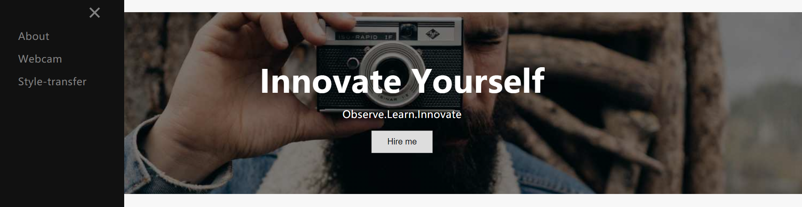

# A Web Application for Style Transfer

Style Transfer learns the aesthetic style of a `style image`, usually an art work, and applies it on another `content image`.

This implemention follows the style transfer approach outlined in https://github.com/rrmina/fast-neural-style-pytorch
## Requirements
Most of the codes here assume that the user have access to CUDA capable GPU, at least a GTX 1050 ti or a GTX 1060

### Dependecies
* [PyTorch](https://pytorch.org/)
* [opencv2](https://matplotlib.org/users/installing.html)
* [NumPy](https://www.scipy.org/install.html)
* [FFmpeg](https://www.ffmpeg.org/) (Optional) - Installation [Instruction here](https://github.com/adaptlearning/adapt_authoring/wiki/Installing-FFmpeg)
* [imutils](https://pypi.org/project/imutils/)
* [flask](https://flask.palletsprojects.com/en/2.0.x/)

## Usage
**`main.py`**: Running on 'http://127.0.0.1:xxxx/'. Clicked the url and the website will be shown on the browser.

<p align = 'center'>

</p>

```
python main.py
```
